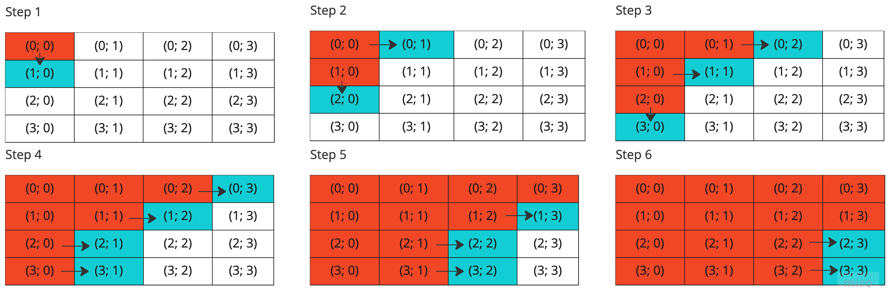

# Распределительные системы
## MPI_SCATTERV

В транспьютерной матрице размером 4*4, в каждом узле которой находится один процесс, необходимо выполнить операцию рассылки данных всем процессам от одного (*MPI_SCATTERV*) - от процесса с координатами (0,0). Каждый i-ый процесс должен получить i чисел (длиной 4 байта). Реализовать программу, моделирующую выполнение операции *MPI_SCATTERV* на транспьютерной матрице при помощи пересылок MPI типа точка-точка. Получить временную оценку работы алгоритма. Оценить сколько времени потребуется для выполнения операции *MPI_SCATTERV*, если все процессы выдали ее одновременно. Время старта равно 100, время передачи байта равно 1 (Ts=100,Tb=1). Процессорные операции, включая чтение из памяти и запись в память, считаются бесконечно быстрыми.


## Решение

Операция MPI_SCATTERV используется для рассылки блоков сообщении разной длины от одного процесса (root) ко всем остальным. Ее прототип выглядит следующим образом:
```
int MPI_Scatterv(void* sendbuf, int *sendcounts,
              int *displs,
              MPI_Datatype sendtype,
              void* recvbuf,
              int recvcount,
              MPI_Datatype recvtype,
              int root,
              MPI_Comm comm)
```

Каждый процесс (кроме тех, которые расположены в 0-ом столбце) по одному разу отправляет порцию, содержащую необходимые данные для всех процессор, другому процессу, таким образом охватывая все элементы нашей траспьютерной матрицы. Учитывая условие задание, что каждый i-ый процесс должен получить i целых чисел, можно упростить себе жизнь тем, чтобы не отсылать i-тому процессу информацию о том, сколько он должен принять данных и где конкретно начинается его порция данных, поэтому для передачи данных другому процессу будет достаточно одной операции `MPI_Isend`. Также условимся, что все процессы могут пересылают данные процессам, которые находятся правее них в топологии, а процессы, расположенные в 0-ом столбце, в добавок могут пересылать еще и нижестоящим (при этом будем отдавать приоритет в отправке тем процессам, которые стоят ниже и потом уже отправлять тем, кто расположен провее. Если придерживаться данной стратегии, то мы охватим все 15 процессов за 6 шагов. Визуально это будет выглядеть следующим образом:



При реализации данного алгоритма были использованы функции `MPI_Isend` и `MPI_Recv` для отправки и принятия сообщения, а также функция `MPI_Cart_rank`.
Теперь оценим время работы алгоритма. Если время старта равно 100, время передачи одного байта – 1 (Ts=100, Tb=1), то время выполнения по сути сводится к тому, чтобы определить, сколько будут пересылаться данные самому дальнему процессу, который находится в ячейке (3; 3). Этого можно достичь за 6 шагов, и тогда время, чтобы передать данные всем процессам будет вычисляться так:
                `time = Ts + n * Tb * steps`
где n – размер передаваемого сообщения в байтах. Так как мы передаем буффер, содержащий сообщение для каждого i-ого процесса, то его конечный размер будет равен: 1 + 2 + 3 + ... + 15 = 120 байт, а размер int в C++ равен 4 байтам. Получаем:
`time = 100 + 4 * 120 * 6 = 2980ms`

## Компиляция и запуск
Чтобы скмпилировать программу:
`mpic++ main.cpp -o main`

Чтобы запустить программу:
`mpirun -np 16 ./main`
